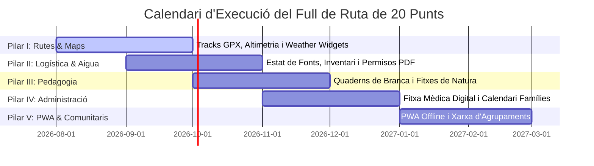

# 🚀 Full de Ruta: 20 Punts de Millora Estratègica per al Portal Escolta

Aquest document estableix el **Pla Director de Millora Estratègica en 20 Punts** per al Portal de Suport del Grup Escolta a Mallorca. Està dissenyat per elevar la plataforma des d'una base de coneixement inicial fins a una infraestructura digital de referència en excursionisme, logística, seguretat, pedagogia i gestió administrativa.

---

## 🗺️ Pilar I: Tecnologia de Rutes i Senderisme (Punts 1–4)

### 1. 📍 Integració de Tracks GPX i KML Descarregables
- **Objectiu**: Incloure enllaços directes de descàrrega de fitxers GPX i KML a les 47+ pàgines de rutes.
- **Impacte**: Permet als caps descarregar el trajecte exacte a aplicacions de navegació offline (*OsmAnd*, *Wikiloc*, *Komoot*, *Maps.me*) abans d'iniciar l'excursió sense cobertura.

### 2. 📈 Gràfics de Perfil de Desnivell i Topografia
- **Objectiu**: Generar i incrustar gràfics interactius de desnivell acumulat (positiu/negatiu) i altimetria a cada fitxa de ruta.
- **Impacte**: Facilita als responsables la visualització dels trams de fort pendent (com el Barranc de Biniaraix o ses Voltes d'en Galileu) per ajustar els ritmes de marxa segons la branca edària.

### 3. 🌤️ Widgets Meteorològics i de Risc d'Incendi en Temps Real
- **Objectiu**: Integrar avisos automàtics de l'AEMET i l'índex de risc d'incendi forestal de l'IBANAT (Nivell 0 a 4) a les pàgines de rutes i refugis.
- **Impacte**: Informació immediata per a la presa de decisions d'emergència davant d'alertes per pluges torrencials (com al Torrent de Pareis) o dies d'extrem risc d'incendi a la Serra de Tramuntana.

### 4. 🚌 Guia de Mobilitat i Transport Públic (TIB / Tren de Sóller)
- **Objectiu**: Catalogar les línies de bus del TIB, estacions de tren i parades més properes a l'inici i final de cada excursió.
- **Impacte**: Redueix la dependència dels vehicles privats, afavoreix el transport col·lectiu sostible i facilita la planificació de rutes lineals.

---

## ⛺ Pilar II: Logística, Campaments i Seguretat al Medi Natural (Punts 5–8)

### 5. 💧 Estat i Fiabilitat de les Fonts d'Aigua Potable
- **Objectiu**: Crear un sistema de registre participatiu sobre l'estat estacional de les fonts naturals (p. ex., *Font de la Trapa: Seca a l'estiu* vs. *Font des Prat: Raig continu*).
- **Impacte**: Evita situacions de deshidratació a la muntanya i permet calcular la ració d'aigua per escolta amb dades reals.

### 6. 🎒 Gestió Digital d'Inventari de Material Col·lectiu
- **Objectiu**: Implementar un mòdul de control d'inventari (tendes d'acampada, moles de cuina, gola, cordes, farmacioles) amb registre de préstecs i manteniment.
- **Impacte**: Optimitza la logística dels campaments d'estiu i petites eixides de cap de setmana, evitant la pèrdua o deteriorament del material del grup.

### 7. 📄 Generador Automàtic de Sol·licituds de Permís (IBANAT / Consell)
- **Objectiu**: Plantilles digitals que auto-omplen els formularis oficials de sol·licitud d'acampada i comunicació prèvia per a grups >20 persones en espais protegits (T-60 dies).
- **Impacte**: Redueix la càrrega administrativa dels caps i evita sancions o denegacions per defecte de forma.

### 8. 🚑 Mapa de Punts d'Extracció d'Emergència i Coberta Mòbil
- **Objectiu**: Marcar a cada pàgina de ruta els punts d'accés per a vehicles 4x4 de rescat (Protecció Civil / Bombers) i la qualitat de cobertura mòbil (3G/4G/5G/Sense Cobertura).
- **Impacte**: Millora radical dels temps de resposta davant d'accidents o evacuacions mèdiques a la Serra de Tramuntana.

---

## ⚜️ Pilar III: Marc Pedagogic i Coneixement Escolta (Punts 9–12)

### 9. 📘 Quaderns de Progressió i Pedagogia per Branques
- **Objectiu**: Integrar les guies educatives específiques per a cada branca: **Castors/Fures** (6-8), **Llops/Daines** (8-11), **Pioners/Rangers** (11-14) i **Rovers/Rutes** (14-18).
- **Impacte**: Proporciona als caps idees de jocs, tallers, dinàmiques de reflexió i rituus adaptats a cada etapa del desenvolupament juvenil.

### 10. 🌿 Fitxes d'Identificació de Natura Balear (Flora, Fauna i Geologia)
- **Objectiu**: Crear una guia de camp digital de les espècies autòctones i endèmiques de Mallorca (*ferrers, voltors negres, sargantana balear, alzines, estepa joana, marjades de pedra en sec*).
- **Impacte**: Enriqueix l'activitat de natura transformant les excursions en tallers d'aprenentatge mediambiental actiu.

### 11. 🛡️ Estàndard Escolta de Conservació i "Sense Deixar Rastre" (LNT)
- **Objectiu**: Definir el protocol de sostenibilitat per a acampades: residu zero, ús de sabons biodegradables, protecció de les marjades i no alteració de la fauna.
- **Impacte**: Assegura que l'activitat escolta sigui un model d'exemplaritat en la conservació del Patrimoni de la Humanitat de la UNESCO.

### 12. 🎵 Cançoner Escolta Digital i Ceremonial
- **Objectiu**: Recopilar el cançoner escolta tradicional i modern (*Cançoner Escoltes de Mallorca*) amb lletres, acords per a guitarra i arxius d'àudio de referència.
- **Impacte**: Manté viva la tradició musical escolta a les vetllades i focs de campament.

---

## 🏛️ Pilar IV: Administració, Famílies i Formació (Punts 13–16)

### 13. 🏥 Fitxa Mèdica i Autoritzacions Digitals Segures (RGPD)
- **Objectiu**: Sistema d'autoritzacions digitals i fitxa mèdica en línia per a pares/mares amb registre d'al·lèrgies, intoleràncies i targeta sanitària.
- **Impacte**: Dades d'emergència immediatament accessibles per als caps durant les excursions des del telèfon mòbil.

### 14. 💰 Calculadora de Pressupost, Menús i Subvencions (Tresoreria)
- **Objectiu**: Eina de càlcul de costos de transport, alimentació equilibrada per persona/dia i gestió de justificacions de subvencions (IBJove, Consell de Mallorca, Ajuntaments).
- **Impacte**: Garantir la sostenibilitat econòmica de l'agrupament i la transparència financera davant les famílies.

### 15. 📅 Portal de Comunicació i Calendari Sincronitzable per a Famílies
- **Objectiu**: Calendari d'activitats en format iCal/Google Calendar integrat al lloc web amb llistes de comprovació d'equipament per a cada eixida.
- **Impacte**: Millora la puntualitat, redueix els dubtes recurrents dels pares i assegura que els alpes portin el material adequat.

### 16. 🎓 Registre de Formació i Titulacions de l'Equip de Caps
- **Objectiu**: Seguiment de les titulacions de Temps Lliure (Monitor/a, Director/a, Primers Auxilis, DEA, Socorrisme) de l'equip de responsables.
- **Impacte**: Assegura el compliment legal de les ràtios de monitors titulats exigides per la normativa de joventut de les Illes Balears.

---

## 🌐 Pilar V: Tecnologia PWA, Desplegament i Xarxa Comunitaria (Punts 17–20)

### 17. 📱 Mode PWA (Progressive Web App) i Accés 100% Offline
- **Objectiu**: Convertir el lloc web MkDocs en una aplicació PWA instal·lable als mòbils amb memòria cau offline.
- **Impacte**: Permet als caps consultar qualsevol pàgina del Wiki, mapa o fitxa mèdica fins i tot al bell mig de la muntanya sense cap mena de connexió a Internet.

### 18. ⚡ Desplegament Continuat Automatitzat (Cloudflare Pages / GitHub)
- **Objectiu**: Automatitzar l'execució diària dels scrapers a GitHub Actions i desplegar en segons a Cloudflare Pages.
- **Impacte**: Mantenir les dades del Wiki sempre actualitzades sense cap despesa de manteniment ni d'allotjament web (€0/mes).

### 19. 🤝 Xarxa de Cooperació entre Agrupaments de Mallorca
- **Objectiu**: Taulell compartit entre agrupaments per al préstec de locals (casals), cessió de material de campament i intercanvi d'experiències.
- **Impacte**: Enforteix la fraternitat escolta balear i maximitza l'ús dels recursos existents.

### 20. 🌍 Pont de Transferència de Coneixement amb l'Escoltisme Mundial
- **Objectiu**: Traduir i compartir els procediments i guies de Mallorca amb la xarxa global de la WOSM / WAGGGS.
- **Impacte**: Posiciona l'escoltisme de Mallorca com a referent internacional en gestió d'espais naturals insulars i seguretat.

---

## 📊 Matriu de Priorització i Calendari d'Execució

