# Procediments Operatius Estàndard (SOPs) i Cronograma d'Excursions

Per tal de garantir la seguretat, complir amb les normatives administratives de Mallorca i organitzar les activitats escoltes sense estrès, s'estableix el següent **cronograma obligatori (SOP)** per a totes les eixides, campaments i excursions.

---

## 📅 Cronograma de Planificació d'Activitats

```mermaid
gantt
    title Cronograma de Planificació d'Excursions i Campaments (T-60 a T-0)
    dateFormat  X
    axisFormat T-%d d
    
    Sol·licitud de Permisos (IBANAT/Consell/Ajuntaments) :active, p1, 0, 30
    Reconeixement de Ruta sobre el Terreny            :p2, 30, 45
    Pressupost, Menú i Compra d'Aliments             :p3, 45, 53
    Tancament Fitxes Mèdiques i Avisos Famílies      :p4, 53, 60
```

---

### ⏳ T-60 dies: Sol·licitud de Permisos i Terrenys
- **Responsable:** Equip de Logística i Permisos.
- **Accions:**
  1. Enviar sol·licitud a la plataforma de reserves de l'**IBANAT** (per a refugis/àrees recreatives) o **Consell de Mallorca** (refugis GR-221).
  2. En cas de finca privada o terreny parroquial, signar el conveni/autorització amb la propietat.
  3. Si l'activitat inclou >20 participants en espais naturals protegits (Parc Natural de Llevant, Serra de Tramuntana), registrar la comunicació prèvia a la Conselleria de Medi Ambient.

---

### 🔍 T-30 dies: Reconeixement de Ruta i Avaluació de Riscos
- **Responsable:** Caps de Branca i Seguretat.
- **Accions:**
  1. Realitzar la ruta a peu per part d'un parell de responsables (reconeixement in situ).
  2. Comprovar l'estat dels passos de pedra en sec, punts d'aigua potable i zones d'ombra.
  3. Marcar els punts d'evacuació d'emergència i verificar la cobertura mòbil.

---

### 🛒 T-15 dies: Logística, Pressupost i Menú
- **Responsable:** Tresoreria i Intendència.
- **Accions:**
  1. Dissenyar el menú equilibrat adaptat a al·lèrgies i intolèrgies.
  2. Calcular el pressupost per escolta i revisar el material de cuina col·lectiu (fogons, gola, bidons d'aigua).
  3. Confirmar la reserva de transport col·lectiu (autocar o tren de Sóller/TIB).

---

### 🏥 T-7 dies: Fitxes Mèdiques i Seguretat
- **Responsable:** Responsable de Seguretat i Primers Auxilis.
- **Accions:**
  1. Revisar la caixa de farmaciola de campament i reposar material caducat.
  2. Verificar que tots els escoltes tenen la fitxa mèdica signada i targeta sanitària vigent.
  3. Preparar la llista de contactes d'emergència (**112**, **IBANAT 971 17 76 52**, centre de salut més proper).
